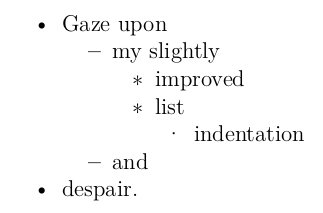
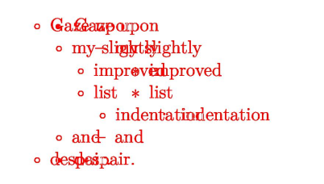

# pdf-stuff

Scripts for working with PDFs-- comparing PDFs, extracting glyphs, that sort of thing.

## Installation

I haven't yet uploaded this to PyPI, but you can still clone the repo and install it thus:

```bash
# Install like a regular Python package
pip install .

# For development/hacking
pip install --editable .
```


# Usage

## pdfdiff.py

Compare two PDFs to look for differences.

```bash
# Compare two PDFs
pdfdiff.py one.pdf another.pdf

# See help message for more options
pdfdiff.py --help
```

### Example

I created a few PDFs using [my `makedown` project](https://github.com/rldotai/makedown), which is basically a Makefile that wraps `pandoc`.
The default is [`example/makedown-1.pdf`](example/makedown-1.pdf) and the one with a bit of customization is [`example/makedown-2.pdf`](example/makedown-2.pdf).

We can see the difference between my slightly customized template and the default by comparing them via:

```bash
pdfdiff.py example/makedown-1.pdf example/makedown-2.pdf
```

The results are mostly identical, except for the lists, which use a consistent bullet type and less spacing when generated via my template.

A | B | Diff
:--:|:---:|:---:
 |  | 

