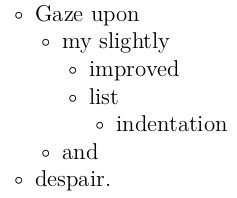
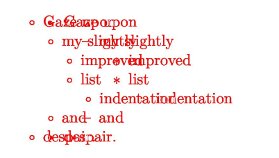

# pdfdiff.py


```bash
# Compare two PDFs -- produces `diff.pdf`
pdfdiff.py makedown-1.pdf makedown-2.pdf

# Compare PDFs at a different resolution, output to `alt_filename.pdf`
pdfdiff.py makedown-1.pdf makedown-2.pdf--dpi=72 --output="alt_filename.pdf"

# Compare using XOR of images, instead of "any" difference
pdfdiff.py makedown-1.pdf makedown-2.pdf --method='xor'
```

The default options should produce something like:

A | B | Diff
:--:|:---:|:---:
 |  | 
